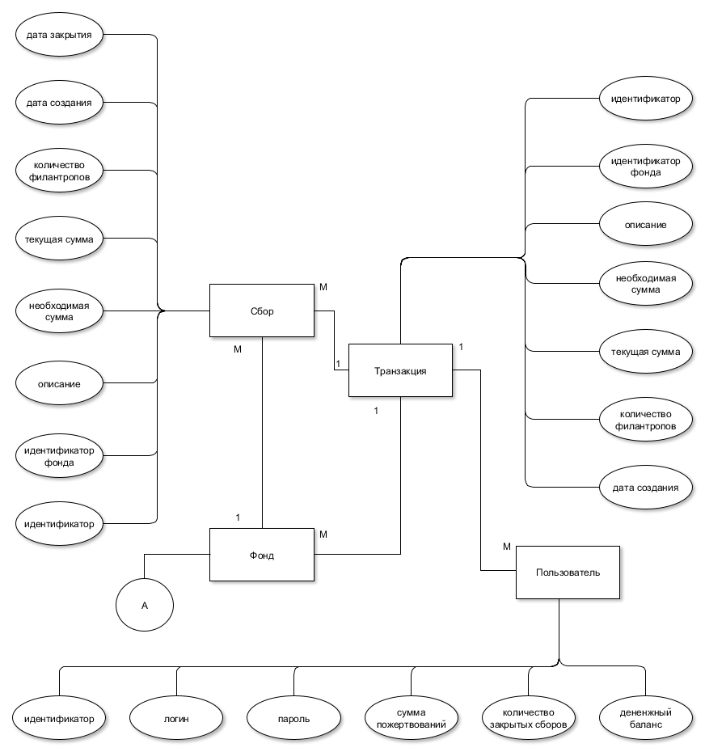
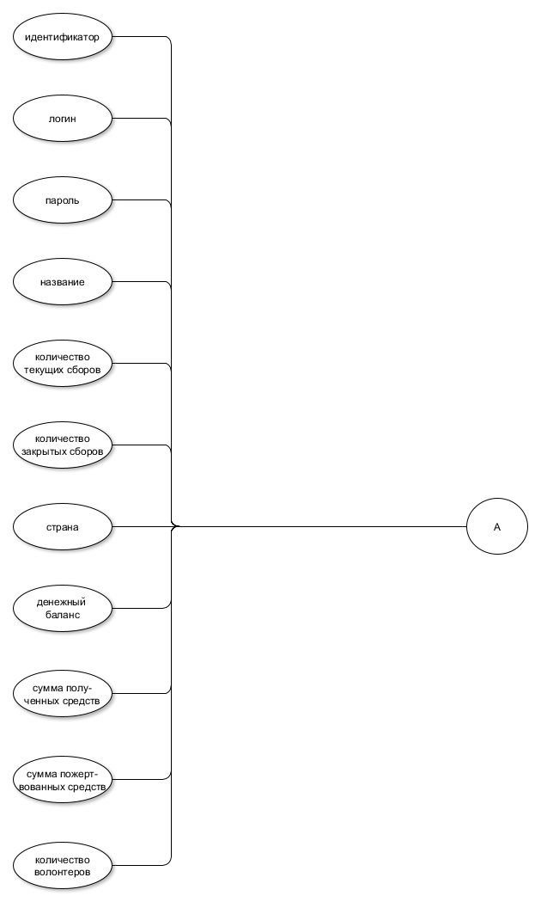
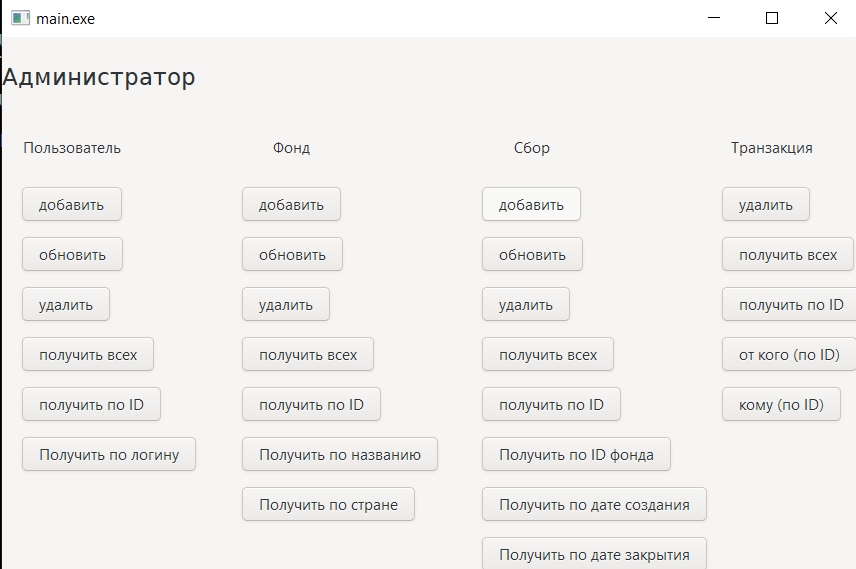
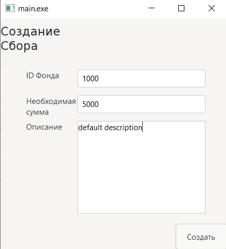
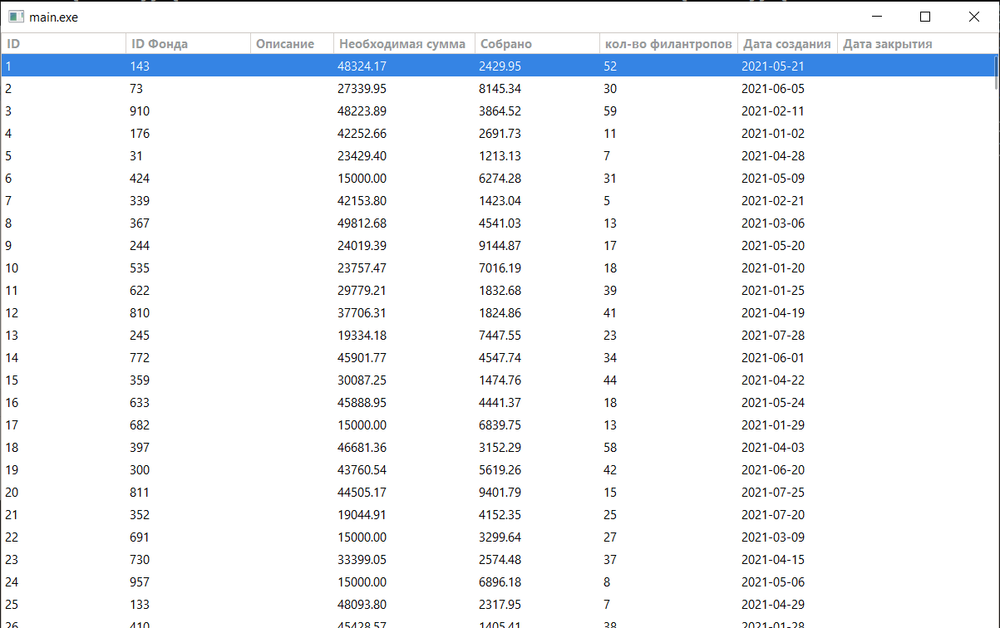

### Цель
Создание информационной системы для международных благотворительных фондов, содержащей информацию о фондах, сборах и пользователях. Разрабатываемое ПО должно предоставлять интерфейс для взаимодействия с базой данных с возможностью для фондов создавать, удалить, редактировать сборы, а для пользователей производить благотворительную деятельность.
### Функциональные требования
Для взаимодействия с Web-приложением было выделено три категории пользователя: пользователь, фонд и администратор.

Пользователь -  имеет возможность осуществлять просмотр информации о фондах, просмотр информации о выбранном фонде, просмотр информации о сборах выбранного фонда, изменение логина, изменение пароля, пополнение баланса, осуществление пожертвования

Фонд - создание, измение,просмотр сборов, информация о собственных сборах, изменение логина, изменение пароля, пополнение баланса, осуществление пожертвования

Администратор – удаление пользователей, сборов, фондов, транзакций, получение информации обо всех или о каждом из пользователей, сборов, фондов, транзакций, создание и изменение пользователей, фондов, сборов
### Use-case диаграмма

### ER-диаграмма

### Диаграмма БД

### Экраны будущего web-приложения на уровне черновых эскизов.

